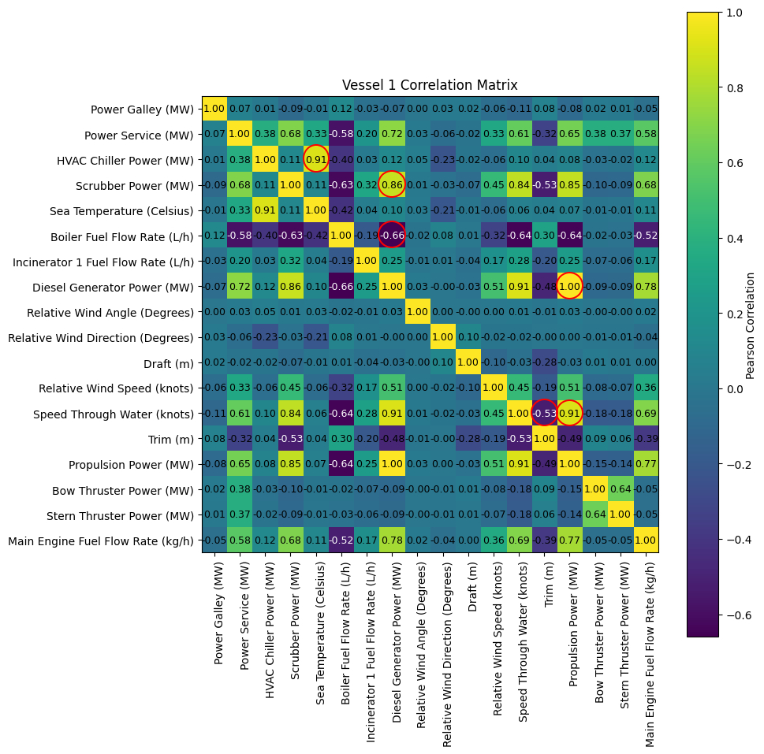
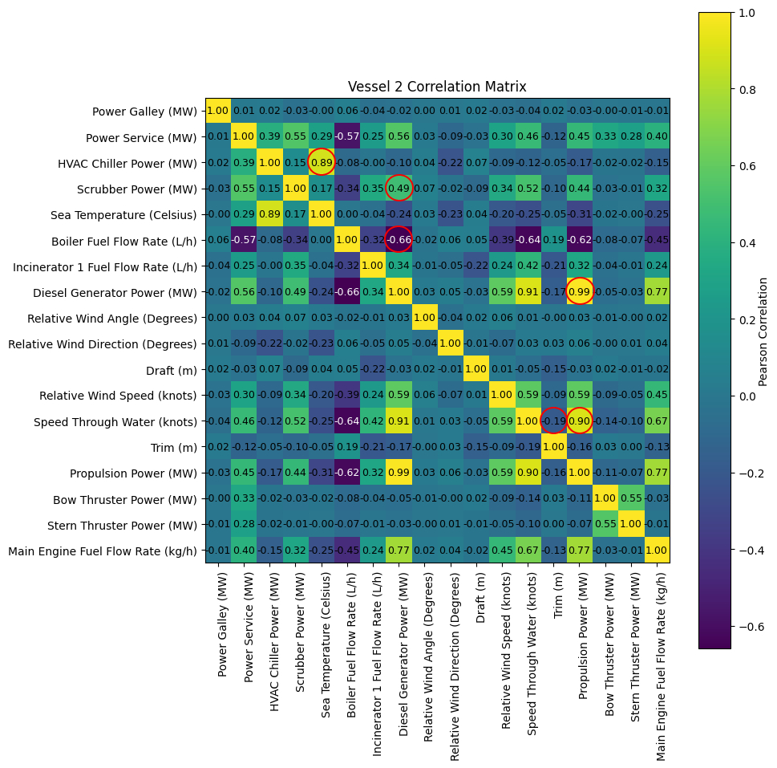

# TUI Cruise Ships Analysis

This project analyzes the provided dataset for two cruise ships and develops a narrative explaining performance trends.

The [data](./data/data.csv) used for this project can be found here.

For further details about the dataset, refer to the [Data Schema](./data/schema.pdf).

---

# Vessel 1

## Data Overview

- **Total Rows:** 105,120  
  - Each measurement is taken at 5-minute intervals.
  - There are 541 missing values in vessel 1 data (excluding Depth (m) column).
  - There are 4786 missing values in vessel 2 data (excluding Depth (m) column).

- **Total Columns:** 44  
  - Numeric: 41  
  - Categorical: 1  
  - Time: 2  

---

## Route

### Vessel 1

### Vessel 2

---

## Exploratory Data Analysis

### Feature Selection
1. **Dropped Columns:**
   - `Vessel Name` and `Bow Thruster 1 Power (MW)` had only one unique value, so they were removed.
   - `Depth (m)` had 27,756 missing values (26.4% of the data) in vessel 1 and 29,738 missing values (28.28% of the data) in vessel 2, so it was dropped.
   - `Propulsion Power (MW)` is the sum of `Port Side Propulsion Power (MW)` and `Starboard Side Propulsion Power (MW)`, so the individual propulsion columns were dropped.
   - `Start Time`, `End Time`, and `Local Time (h)` were dropped because measurements occur at consistent 5-minute intervals.
   - `Longitude (Degrees)` and `Latitude (Degrees)` were excluded from the analysis.

2. **Speed Features:**
   - `Speed Through Water (knots)` was retained because it directly relates to propulsion efficiency and helps isolate the effects of water conditions. `Speed Over Ground (knots)` was dropped.

3. **Wind Features:**
   - `Relative Wind Angle (Degrees)`, `Relative Wind Speed (knots)`, and `Relative Wind Direction (Degrees)` were kept as they reflect how wind forces interact with the vessel, influencing aerodynamic drag and resistance. The corresponding true wind measurements (`True Wind Angle`, `True Wind Speed`, and `True Wind Direction`) were dropped.

4. **Aggregated Features:**
   - The values for the following components were aggregated:
     - Power Galley (MW)
     - HVAC Chiller Power (MW)
     - Boiler Fuel Flow Rate (L/h)
     - Diesel Generator Power (MW)
     - Bow Thruster Power (MW)
     - Stern Thruster Power (MW)
     - Main Engine Fuel Flow Rate (kg/h)

---

### Handling Missing Values

**Vessel 1:**

1. For columns with only one missing value, the gaps were filled using the mean of the values before and after.
2. Other columns (with up to 171 missing values) were backfilled (future scope: regression techniques could be applied to fill these missing values).

**Vessel 2:**

1. All columns (with up to 972 missing values) were backfilled (future scope: regression techniques could be applied to fill these missing values).

---

### Correlation Analysis

**Vessel 1**

**Vessel 2**

---

### Observations

| Feature 1                   | Feature 2                   | Vessel 1 Correlation | Vessel 2 Correlation |
| --------------------------- | --------------------------- | -------------------- | -------------------- |
| Diesel Generator Power (MW) | Propulsion Power (MW)       | 0.995799             | 0.991696             |
| Propulsion Power (MW)       | Speed Through Water (knots) | 0.911505             | 0.904470             |
| HVAC Chiller Power (MW)     | Sea Temperature (Celsius)   | 0.911329             | 0.885724             |
| Diesel Generator Power (MW) | Boiler Fuel Flow Rate (L/h) | -0.660057            | -0.659181            |
| Diesel Generator Power (MW) | Scrubber Power (MW)         | 0.862290             | 0.490685             |
| Speed Through Water (knots) | Trim (m)                    | -0.534795            | -0.191748            |

#### **Diesel Generator Power and Main Engine Fuel Flow Rate**

| Feature 1                    | Feature 2                           | Vessel 1 Correlation | Vessel 2 Correlation |
| ---------------------------- | ----------------------------------- | -------------------- | -------------------- |
|Diesel Generator 1 Power (MW) | Main Engine 1 Fuel Flow Rate (kg/h) | 0.999219             | 0.998309             |
|Diesel Generator 2 Power (MW) | Main Engine 2 Fuel Flow Rate (kg/h) | 0.998504             | 0.996328             |
|Diesel Generator 3 Power (MW) | Main Engine 3 Fuel Flow Rate (kg/h) | 0.992567             | 0.998333             |
|Diesel Generator 4 Power (MW) | Main Engine 4 Fuel Flow Rate (kg/h) | 0.997194             | 0.996969             |

---

### Conclusions

1. **Efficient Power Management for Propulsion Needs:**

The strong link between Diesel Generator power and propulsion consumption across both vessels reflects a focus on efficiently matching power generation with propulsion demands, indicating good energy management practices.

2. **Speed Optimization Through Power Management:**

The high correlation between propulsion power and speed through water suggests that any adjustments in propulsion power can significantly influence speed, providing opportunities for optimizing speed for better fuel efficiency and route planning.

3. **Adaptation to Environmental Conditions:**

HVAC power consumption's strong correlation with sea temperature highlights the need for adaptive strategies to manage cooling loads as environmental conditions change, helping to maintain efficiency in warmer climates.

4. **Dynamic Energy Management Strategies:**

The inverse relationship between Diesel Generator power and Boiler fuel consumption demonstrates effective load-sharing practices, where waste heat recovery and other strategies help to optimize overall energy use and reduce the reliance on boiler fuel.

5. **Variable Influence of Scrubber Operations:**

The different correlations between Diesel Generator power and scrubber consumption for the two vessels suggest distinct emission control practices, with Vessel 1 showing a more direct link between generator activity and scrubber use compared to Vessel 2.

6. **Importance of Trim Optimization for Vessel Performance:**

Trim adjustments have a significant impact on speed and resistance for Vessel 1, indicating a potential area for performance improvement through trim management. Vessel 2 appears to be less affected by trim changes, possibly due to design differences.

7. **Tight Coupling Between Diesel Generators and Main Engines:**

The power generation by Diesel Generators is almost perfectly aligned with the fuel flow rate of the corresponding Main Engines, indicating a direct relationship between engine load and generator power output. The near-perfect correlations can serve as a benchmark for detecting anomalies or deviations in the relationship, which could indicate potential engine or generator issues.

> These inferences are based on linear correlations only and do not imply causation.

---