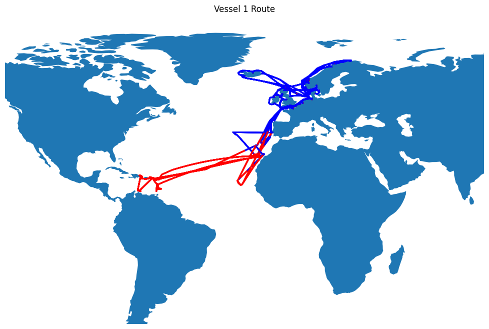

# TUI Cruise Ships Analysis
This project will Analyze the provided dataset for two Cruise ships and develop a narrative explaining the performance trends.

# Vessel 1

### Data Schema
A document providing further details about the dataset: [Data Schema](./data/schema.pdf)

---

## Data Overview

- Rows: 105120
    - Each measurement is taken in an interval of 5 minutes.
    - 541 NA values.
- Columns: 44
    - Numeric: 41
    - Category: 1
    - Time: 2

---

## Vessel 1 Route

---

## Exploratory Data Analysis

### Feature Selection
1. ``Vessel Name`` and ``Bow Thruster 1 Power (MW)`` have only 1 value, so the columns are dropped.
2. ``Depth (m)`` has 27756 NA values (26.4%), so the column is dropped.
3. ``Propulsion Power (MW)`` is sum of ``Port Side Propulsion Power (MW)`` and ``Starboard Side Propulsion Power (MW)``, so port and starboard side columns are dropped.
4. Since each record is with 5 minute interval, ``Start Time``, ``End Time``, and ``Local Time (h)`` are dropped.
5. ``Longitude (Degrees)``, ``Latitude (Degrees)`` are dropped from the analysis.
6. ``Speed Through Water (knots)`` allows for an assessment that isolates the effects of water conditions and directly relates to the efficiency of the propulsion system. ``Speed Over Ground (knots)`` is dropped.
7. The relative features (``Relative Wind Angle (Degrees)``, ``Relative Wind Speed (knots)``, and ``Relative Wind Direction (Degrees)``) are measures of how wind forces interact with the vessel, influencing the aerodynamic drag and resistance that the vessel experiences. ``True Wind Angle (Degrees)``, ``True Wind Speed (knots)``, and ``True Wind Direction (Degrees)`` are dropped.
8. Values for the following components are summed up:
    - Power Galley (MW)
    - HVAC Chiller Power (MW)
    - Boiler Fuel Flow Rate (L/h)
    - Diesel Generator Power (MW)
    - Bow Thruster Power (MW)
    - Stern Thruster Power (MW)
    - Main Engine Fuel Flow Rate (kg/h)

---

### Handle NA Values
1. There are many columns with only 1 NA value. The value is filled by taking the mean of values before and after.
2. There are few columns with upto 171 NA values. Since the measurements are sequential, these values are back filled (future scope: use regression to fill these na values).

---

### Correlation

| Feature | Feature | Pearson Correlation |
| --- | --- | --- |
| Speed Through Water (knots) | Speed Over Ground (knots) | 0.99 |
| Relative Wind Angle (Degrees) | True Wind Angle (Degrees) | 0.94 |
| Relative Wind Speed (knots) | True Wind Speed (knots) | 0.77 |
| Relative Wind Direction (Degrees) | True Wind Direction (Degrees) | 0.66 |

---

### Inferences

1. A high positive correlation (0.99) between Diesel Generator Power (MW) and Propulsion Power (MW) suggests that the diesel generator is almost entirely dedicated to supporting propulsion power demands and non-propulsion electrical loads likely contribute only a small portion to the total power consumption. 
2. A high positive correlation (0.91) between Propulsion Power (MW) and Speed Through Water (knots) implies that propulsion power consumption can be reliably estimated based on the ship's speed through the water. 
3. A high positive correlation (0.91) between HVAC Chiller Power (MW) and Sea Temperature (Celsius) suggests a consistent operational pattern where the chiller workload increases with higher temperatures due to increased cooling requirements.
4. A high positive correlation (0.85) between Scrubber Power (MW) and Propulsion Power (MW) suggests that efforts to optimize propulsion efficiency could also reduce the scrubber system's power consumption.
5. A correlation (0.77) between Diesel Generator Power (MW) and Main Engine Fuel Flow Rate (kg/h) highlights the interdependence of mechanical and electrical power needs and suggests potential opportunities for optimizing overall energy consumption by managing engine loads and power generation together.
6. A negative correlation (-0.66) between Diesel Generator Power (MW) and Boiler Fuel Flow Rate (L/h) could imply a trade-off or complementary usage between the Boiler and the Diesel Generator in meeting the ship's energy demands.
7. A negative correlation (-0.53) between Trim (m) and Speed Through Water (knots) suggests that optimizing the trim could help improve the ship's speed through water and fuel efficiency.
8. A high positive correlation (0.99) between Speed Through Water (knots) and Speed Over Ground (knots) suggests that the water currents or tidal effects experienced by the vessel are relatively minimal or stable over time.
9. A high positive correlation (0.94) between Relative Wind Angle (Degrees) and True Wind Angle (Degrees) suggests that the vessel's speed and course relative to the wind direction are consistent.
10. However, a weak correlation (0.77, 0.66) between Relative Wind Speed (knots) and True Wind Speed (knots), Relative Wind Direction (Degrees) and True Wind Direction (Degrees) indicates some variability in the vessel's speed or course changes.
> These inferences are based only on linear correlation between factors. They do not account for any causation.

---

### Conclusions

1. Efficiency optimizations related to propulsion, such as reducing speed or optimizing routes, would directly impact the overall power generation and fuel consumption, potentially leading to significant savings.
2. There are no significant variations in performance due to fouling or mechanical issues.
3. There is an opportunity to optimize energy use based on sea temperature forecasts.
4. Reducing propulsion power can lower both fuel consumption and the demand for exhaust treatment, implying fuel efficiency and environmental compliance.
5. Other factors influence the Diesel Generator's power output besides the Main Engine's fuel flow, including variations in non-propulsion electrical loads (e.g., HVAC, lighting), changes in sea conditions, or operational practices that affect power distribution onboard.
6. Using a strategy of load shifting, where the ship's energy management system adjusts the usage of the Boiler and Diesel Generator based on current demands or operational conditions.
7. Lower trim values might reduce resistance and allow for higher speeds at the same propulsion power. Properly balancing cargo and adjusting ballast to achieve an optimal trim could help maximize speed and minimize fuel consumption.

---