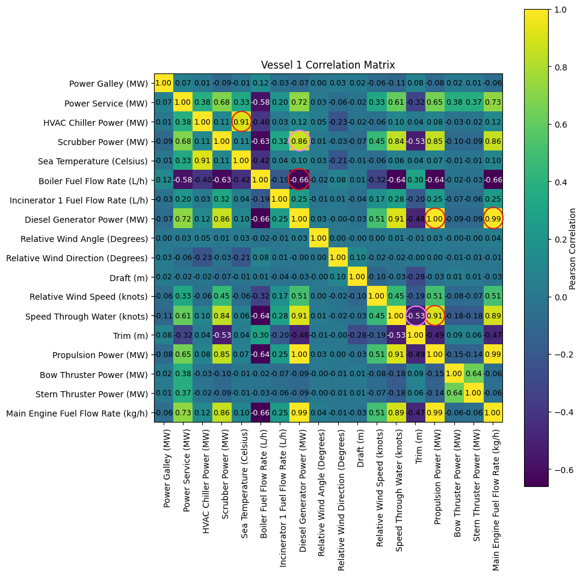

# TUI Cruise Ships Analysis

This project analyzes the provided dataset for two cruise ships and develops a narrative explaining performance trends.

## Folder Structure
1. **Data**
   - *./data/data.csv:* The data used for this project can be found here.
   - *./data/schema.pdf:* For further details about the dataset, refer to the data schema.
2. **Code**
   - *./code/vessel1.ipynb:* Code for exploratory data analysis for vessel 1.
   - *./code/vessel2.ipynb:* Code for exploratory data analysis for vessel 2.
   - *./code/regression.ipynb:* Code for regression analysis.
   - *./code/clustering.ipynb:* Code for clustering.
3. **Assets**
   - *./assets/\*:* Contains plots and images for preparing the documentation.

---

## Data Overview

- **Total Rows:** 105,120  
  - Each measurement is taken at 5-minute intervals.
  - There are 541 missing values in vessel 1 data (excluding Depth (m) column).
  - There are 4786 missing values in vessel 2 data (excluding Depth (m) column).

- **Total Columns:** 44  
  - Numeric: 41  
  - Categorical: 1  
  - Time: 2  

---

## Exploratory Data Analysis

### Feature Selection
1. **Dropped Columns:**
   - `Vessel Name` and `Bow Thruster 1 Power (MW)` had only one unique value, so they were removed.
   - `Depth (m)` had 27,756 missing values (26.4% of the data) in vessel 1 and 29,738 missing values (28.28% of the data) in vessel 2, so it was dropped.
   - `Propulsion Power (MW)` is the sum of `Port Side Propulsion Power (MW)` and `Starboard Side Propulsion Power (MW)`, so the individual propulsion columns were dropped.
   - `Start Time`, `End Time`, and `Local Time (h)` were dropped because measurements occur at consistent 5-minute intervals.
   - `Longitude (Degrees)` and `Latitude (Degrees)` were excluded from the analysis.

2. **Speed Features:**
   - `Speed Through Water (knots)` was retained because it directly relates to propulsion efficiency and helps isolate the effects of water conditions. `Speed Over Ground (knots)` was dropped.

3. **Wind Features:**
   - `Relative Wind Angle (Degrees)`, `Relative Wind Speed (knots)`, and `Relative Wind Direction (Degrees)` were kept as they reflect how wind forces interact with the vessel, influencing aerodynamic drag and resistance. The corresponding true wind measurements (`True Wind Angle`, `True Wind Speed`, and `True Wind Direction`) were dropped.

4. **Aggregated Features:**
   - The values for the following components were aggregated:
     - Power Galley (MW)
     - HVAC Chiller Power (MW)
     - Boiler Fuel Flow Rate (L/h)
     - Diesel Generator Power (MW)
     - Bow Thruster Power (MW)
     - Stern Thruster Power (MW)
     - Main Engine Fuel Flow Rate (kg/h)

---

### Handling Missing Values

**Vessel 1**

1. For columns with only one missing value, the gaps were filled using the mean of the values before and after.
2. Other columns (with up to 171 missing values) were backfilled (future scope: regression techniques could be applied to fill these missing values).

**Vessel 2**

1. All columns (with up to 972 missing values) were backfilled (future scope: regression techniques could be applied to fill these missing values).

---

### Correlation Analysis

**Vessel 1**

**Vessel 2**

---

### Observations

1. The vessels show high operational efficiency by aligning power generation, propulsion, and fuel usage.
2. Both vessels efficiently convert propulsion power into forward motion, reflecting good propulsion system performance.
3. Environmental factors like sea temperature significantly impact energy consumption, particularly in auxiliary systems like HVAC.
4. The trade-off between main engine and boiler fuel usage indicates efforts to minimize overall fuel consumption, possibly through energy recovery techniques.
5. Variability in scrubber usage and trim adjustments between the vessels may reflect different operational practices, vessel designs, or regulatory requirements.

> These inferences are based on linear correlations only and do not imply causation.

---

## Regression Analysis

Train Regression models to predict the Speed of the vessel based on other features.

- **Models**
   - Linear Regression
   - XGB Regressor
- **Training data** 

   Vessel 2
   - Model is trained on 75% of the data (78840 rows).
   - Model is tested on 25% of the data (26280 rows).
- **Evaluation data** 

   Vessel 1
   - Model is evaluated on 105120 rows of unseen data pertaining to a different vessel.
- **Target Variable** ``Speed Through Water (knots)``
- **Features**
   - 'Propulsion Power (MW)'

      |         |Linear Regression      |XGB Regressor          |
      |---------|-----------------------|-----------------------|
      |Test data|R² = 0.81, RMSE = 3.29 |R² = 0.95, RMSE = 1.56 |
      |Eval data|R² = 0.82, RMSE = 3.17| R² = 0.96, RMSE = 1.39 |
   
   - 'Power Galley (MW)', 'Power Service (MW)', 'HVAC Chiller Power (MW)', 'Scrubber Power (MW)', 'Sea Temperature (Celsius)', 'Boiler Fuel Flow Rate (L/h)', 'Incinerator 1 Fuel Flow Rate (L/h)', 'Relative Wind Angle (Degrees)', 'Relative Wind Direction (Degrees)', 'Draft (m)', 'Relative Wind Speed (knots)', 'Trim (m)', 'Propulsion Power (MW)', 'Bow Thruster Power (MW)', 'Stern Thruster Power (MW)'
      > ``Diesel Generator Power (MW)`` and ``Main Engine Fuel Flow Rate (kg/h)`` are excluded because they are highly correlated to ``Propulsion Power (MW)``

      |         |Linear Regression      |XGB Regressor          |
      |---------|-----------------------|-----------------------|
      |Test data|R² = 0.86, RMSE = 2.84 |R² = 0.99, RMSE = 0.68 |
      |Eval data|R² = 0.85, RMSE = 2.93 |R² = 0.94, RMSE = 1.83 |
- **Key Performance Indicators**
   - Linear Regression

      | Feature                            | Coefficient |
      |------------------------------------|-------------|
      | Propulsion Power (MW)              | 5.14        |
      | Sea Temperature (Celsius)          | -1.03       |
      | Scrubber Power (MW)                | 0.98        |
      | Boiler Fuel Flow Rate (L/h)        | -0.81       |
      | Incinerator 1 Fuel Flow Rate (L/h) | 0.73        |

   - XGB Regressor

      | Feature                            | Feature Importance |
      |------------------------------------|--------------------|
      | Propulsion Power (MW)              | 0.93               |
      | Bow Thruster Power (MW)            | 0.01               |
      | Draft (m)                          | 0.008              |
      | Incinerator 1 Fuel Flow Rate (L/h) | 0.006              |
      | Scrubber Power (MW)                | 0.005              |
- **Observations**
   - When using "Propulsion Power (MW)" as the sole feature to predict "Speed Through Water (knots)", XGB achieves a high R² (0.95 on the test data and 0.96 on the evaluation data), indicating that this feature alone explains most of the variance in the vessel's speed.
   - Incorporating additional features improves both models' performance. For the XGB Regressor, the R² increases to 0.99 on the test data, indicating a nearly perfect fit. However, its performance drops slightly when evaluated on unseen data (R² = 0.94), indicating some overfitting to the training vessel data.
   - The results imply that "Propulsion Power (MW)" is the most critical factor for predicting vessel speed, suggesting a direct and strong relationship between engine power and vessel velocity.
   - Environmental conditions like "Sea Temperature (Celsius)" also impact vessel speed, although their effects are less pronounced compared to propulsion power.

---

## Clustering

- **Model**
   - KMeans
- **Training Data**
   - Vessel 1
- **Inference Data**
   - Vessel 2
- **Features Used**
   - 'Power Galley (MW)', 'Power Service (MW)', 'HVAC Chiller Power (MW)', 'Scrubber Power (MW)', 'Sea Temperature (Celsius)', 'Boiler Fuel Flow Rate (L/h)', 'Incinerator 1 Fuel Flow Rate (L/h)', 'Diesel Generator Power (MW)', 'Relative Wind Angle (Degrees)', 'Relative Wind Direction (Degrees)', 'Draft (m)', 'Relative Wind Speed (knots)', 'Speed Through Water (knots)', 'Trim (m)', 'Propulsion Power (MW)', 'Bow Thruster Power (MW)', 'Stern Thruster Power (MW)', 'Main Engine Fuel Flow Rate (kg/h)', 'Cluster'
- **Elbow Graph**
   - k = 7
   - The optimal k value is identified at the point where the graph bends like an elbow.

      
- **Clusters**
   - Train a KMeans model for 7 clusters.
   - PCA is applied to reduce the dimension to 2 principal components. Clusters are visualized with a scatter plot.

      
- **Route**
   - Based on visual inspection of the clusters, clusters 0, 4, 5 are shown in blue and clusters 1, 2, 3, 6 are shown in red below.
   - Then the route map is plotted using latitude and longitude and colored based on the cluster they belong to.
   
      
      
- **Feature Importance**
   - A Random Forest Classifier model is trained using the clusters as labels in order to find feature importance.
      | Feature                           | Feature Importance |
      |-----------------------------------|--------------------|
      | Power Galley (MW)                 | 0.146415           |
      | Sea Temperature (Celsius)         | 0.138925           |
      | Diesel Generator Power (MW)       | 0.109070           |
      | HVAC Chiller Power (MW)           | 0.108595           |
      | Main Engine Fuel Flow Rate (kg/h) | 0.076971           |
- **Observations:**
   - By mapping the routes based on the cluster membership, patterns in vessel behavior across different geographic regions can be observed.
   - The influence of Power Galley on clustering suggests that optimizing these auxiliary power sources could lead to significant improvements in energy efficiency.
   - Variations in Sea Temperature affecting cluster assignments indicate that weather and environmental conditions significantly impact energy consumption patterns.

---

## Conclusions

1. **Operational Efficiency and Power Alignment:**
   - The vessels exhibit a high degree of operational efficiency, as demonstrated by the strong correlation between power generation, propulsion power, and speed. This alignment suggests that the vessels are effectively managing their power systems to optimize energy usage and maintain consistent speed performance.
   - The use of "Propulsion Power (MW)" as the primary predictor for "Speed Through Water (knots)" reveals that the propulsion system's ability to convert mechanical power into forward motion is highly efficient.
2. **Impact of Environmental Factors on Energy Management:**
   - The negative relationship between sea temperature and speed observed in the Linear Regression model suggests that higher temperatures may reduce vessel speed, possibly due to increased water resistance or the need for more energy to power auxiliary systems like HVAC.
3. **Fuel Consumption Optimization Strategies:**
   - The trade-off between the usage of the main engine and boiler fuel indicates efforts to optimize overall fuel consumption. By balancing power generation across multiple energy sources, the vessels may employ energy recovery techniques or load management strategies to minimize fuel usage.
4. **Operational Variability and Adaptation:**
   - The differences in scrubber usage and trim adjustments between the vessels reflect variations in operational practices, vessel designs, or compliance with different regulatory requirements. For example, scrubbers, which reduce sulfur emissions, may be used more frequently on certain routes or in regions with stricter environmental regulations.
5. **Clustering and Route Analysis:**
   - Clustering revealed patterns in vessel behavior across different regions, with auxiliary power sources like Power Galley significantly impacting cluster assignments. Sea temperature variations influencing clustering highlight the importance of environmental conditions on energy usage trends.

---